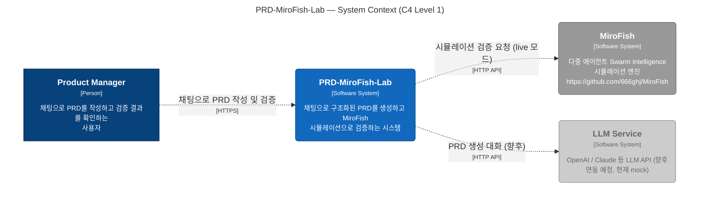
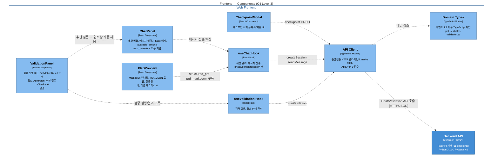
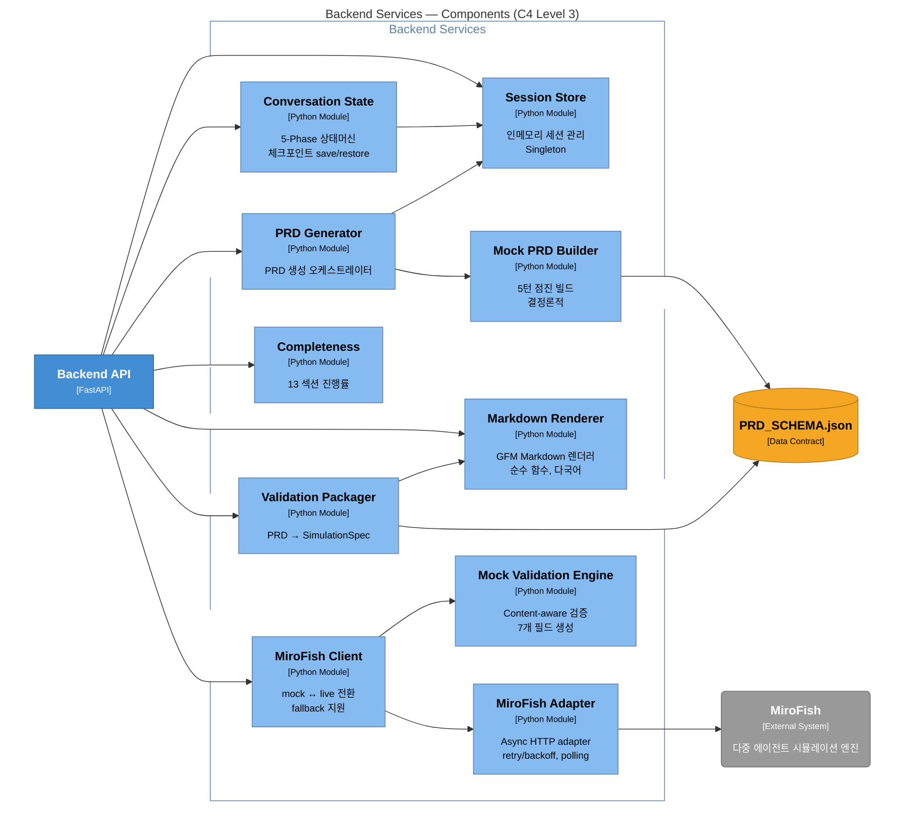
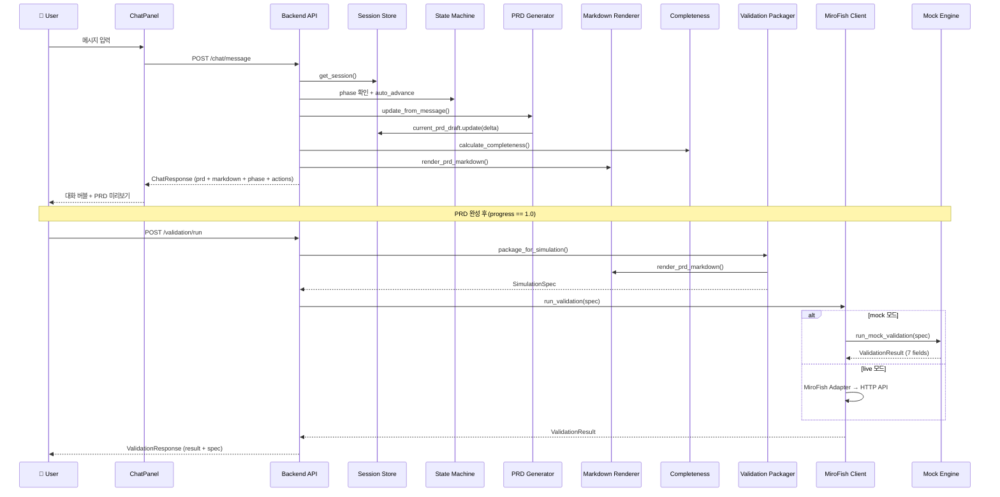

# 🏗️ PRD-MiroFish-Lab Architecture

> **C4 Model 기반 아키텍처 문서** — [Structurizr DSL](../workspace.dsl)에서 자동 생성

이 문서는 PRD-MiroFish-Lab의 아키텍처를 C4 Model의 4단계로 설명합니다.

---

## 📑 목차

- [Level 1: System Context](#level-1-system-context)
- [Level 2: Containers](#level-2-containers)
- [Level 3: Frontend Components](#level-3-frontend-components)
- [Level 3: Backend Services Components](#level-3-backend-services-components)
- [데이터 흐름](#데이터-흐름)
- [Structurizr DSL 사용법](#structurizr-dsl-사용법)

---

## Level 1: System Context

> 사용자, PRD-MiroFish-Lab 시스템, 외부 서비스 간의 관계



**설명:**
- **Product Manager**: 브라우저에서 3-Panel UI를 통해 채팅으로 PRD를 작성
- **PRD-MiroFish-Lab**: 핵심 시스템 — 채팅 → PRD 생성 → 검증 파이프라인
- **MiroFish**: 외부 시뮬레이션 엔진 (live 모드에서만 호출, 기본은 mock)
- **LLM Service**: 향후 연동 예정 (현재 deterministic mock builder 사용)

---

## Level 2: Containers

> Frontend, Backend API, Services, Schema Validator, Data Contract

```mermaid
graph TB
  linkStyle default fill:#ffffff

  subgraph diagram ["PRD-MiroFish-Lab — Containers (C4 Level 2)"]
    style diagram fill:#ffffff,stroke:#ffffff

    1["<div style='font-weight: bold'>Product Manager</div><div style='font-size: 70%; margin-top: 0px'>[Person]</div><div style='font-size: 80%; margin-top:10px'>채팅으로 PRD를 작성하고 검증 결과를 확인하는<br />사용자</div>"]
    style 1 fill:#08427b,stroke:#052e56,color:#ffffff
    2("<div style='font-weight: bold'>MiroFish</div><div style='font-size: 70%; margin-top: 0px'>[Software System]</div><div style='font-size: 80%; margin-top:10px'>다중 에이전트 Swarm Intelligence<br />시뮬레이션 엔진<br />https://github.com/666ghj/MiroFish</div>")
    style 2 fill:#999999,stroke:#6b6b6b,color:#ffffff

    subgraph 4 ["PRD-MiroFish-Lab"]
      style 4 fill:#ffffff,stroke:#0b4884,color:#0b4884

      5["<div style='font-weight: bold'>Web Frontend</div><div style='font-size: 70%; margin-top: 0px'>[Container: React SPA]</div><div style='font-size: 80%; margin-top:10px'>3-Panel UI (Chat / PRD<br />Preview / Validation) React<br />19, TypeScript 5.9, Vite 8</div>"]
      style 5 fill:#438dd5,stroke:#2e6295,color:#ffffff
      14["<div style='font-weight: bold'>Backend API</div><div style='font-size: 70%; margin-top: 0px'>[Container: FastAPI]</div><div style='font-size: 80%; margin-top:10px'>FastAPI 서버 (11 endpoints)<br />Python 3.11+, Pydantic v2</div>"]
      style 14 fill:#438dd5,stroke:#2e6295,color:#ffffff
      18["<div style='font-weight: bold'>Backend Services</div><div style='font-size: 70%; margin-top: 0px'>[Container: Python]</div><div style='font-size: 80%; margin-top:10px'>비즈니스 로직 계층 10개 서비스 모듈</div>"]
      style 18 fill:#85bbf0,stroke:#5d82a8,color:#000000
      30["<div style='font-weight: bold'>Schema Validator</div><div style='font-size: 70%; margin-top: 0px'>[Container: Python / jsonschema]</div><div style='font-size: 80%; margin-top:10px'>JSON Schema Draft7Validator<br />lru_cache 싱글톤 validate_prd()<br />→ ValidationReport</div>"]
      style 30 fill:#85bbf0,stroke:#5d82a8,color:#000000
      29[("<div style='font-weight: bold'>Data Contract</div><div style='font-size: 70%; margin-top: 0px'>[Container: JSON Schema Draft-07]</div><div style='font-size: 80%; margin-top:10px'>PRD_SCHEMA.json (532줄) 14<br />required sections, 12 enums,<br />9 reusable $defs Single<br />Source of Truth</div>")]
      style 29 fill:#f5a623,stroke:#ab7418,color:#000000
    end

    1-. "<div>브라우저에서 3-Panel UI 사용</div><div style='font-size: 70%'>[HTTPS]</div>" .->5
    5-. "<div>Chat API 호출</div><div style='font-size: 70%'>[HTTP/JSON]</div>" .->14
    14-. "<div>세션 조회/저장</div><div style='font-size: 70%'></div>" .->18
    14-. "<div>JSON Schema 검증</div><div style='font-size: 70%'></div>" .->30
    18-. "<div>HTTP API 호출</div><div style='font-size: 70%'>[httpx]</div>" .->2
    30-. "<div>스키마 로드 (lru_cache)</div><div style='font-size: 70%'></div>" .->29
    18-. "<div>모델 구조 준수</div><div style='font-size: 70%'></div>" .->29

  end
```



**컨테이너 요약:**

| 컨테이너 | 기술 | 역할 |
|----------|------|------|
| **Web Frontend** | React 19, TypeScript, Vite | 3-Panel UI (Chat, PRD Preview, Validation) |
| **Backend API** | FastAPI, Pydantic v2 | 11개 REST 엔드포인트 |
| **Backend Services** | Python 3.11+ | 10개 비즈니스 로직 모듈 |
| **Schema Validator** | jsonschema Draft-07 | PRD 구조 검증 (lru_cache 싱글톤) |
| **Data Contract** | PRD_SCHEMA.json | 14 required sections, 12 enums, 9 $defs |

---

## Level 3: Frontend Components

> React 컴포넌트, Hooks, API Client, Domain Types



---

## Level 3: Backend Services Components

> 10개 서비스 모듈 간의 의존 관계



---

## 데이터 흐름

### 채팅 → PRD 생성 → 검증 전체 흐름



---

## Structurizr DSL 사용법

### 소스 파일

```
workspace.dsl          ← Structurizr DSL (Single Source of Truth)
docs/ARCHITECTURE.md   ← 이 문서 (Mermaid 다이어그램 포함)
```

### 로컬에서 Structurizr Lite로 보기

```bash
# Docker로 Structurizr Lite 실행
docker run -it --rm -p 8080:8080 \
  -v $(pwd):/usr/local/structurizr \
  structurizr/lite

# 브라우저에서 http://localhost:8080 접속
```

### Structurizr CLI로 다이어그램 내보내기

```bash
# Mermaid 포맷 (GitHub 렌더링용)
structurizr-cli export -workspace workspace.dsl -format mermaid -output docs/

# PlantUML 포맷
structurizr-cli export -workspace workspace.dsl -format plantuml/c4plantuml -output docs/

# DSL 검증
structurizr-cli validate -workspace workspace.dsl
```

### 온라인 뷰어

[Structurizr DSL Editor](https://structurizr.com/dsl)에서 `workspace.dsl` 내용을 붙여넣으면 바로 렌더링됩니다.

---

*이 문서는 `workspace.dsl`에서 생성되었습니다. 아키텍처 변경 시 DSL을 먼저 수정하고 이 문서를 재생성하세요.*
